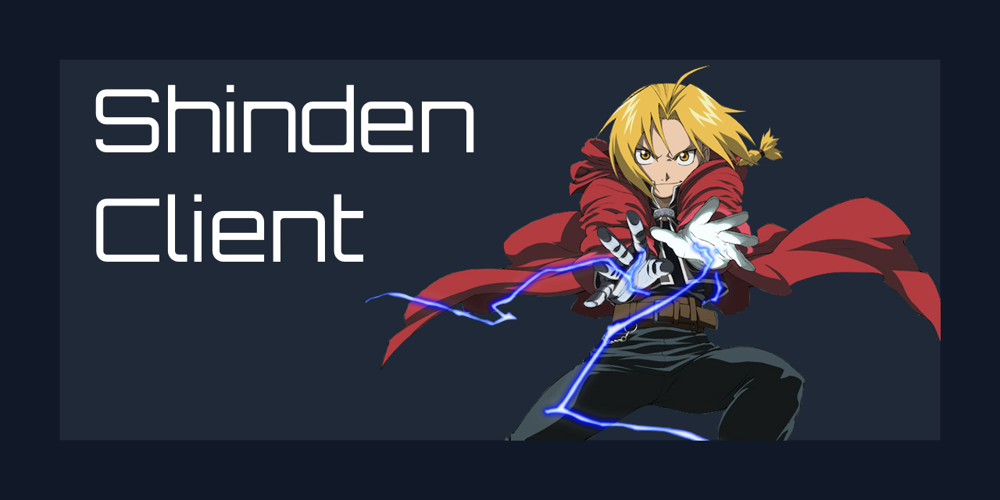
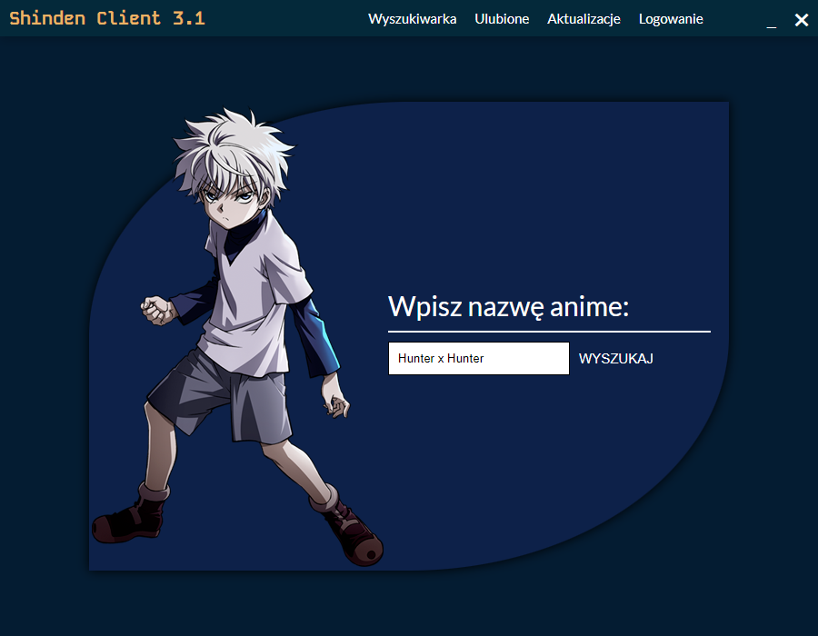
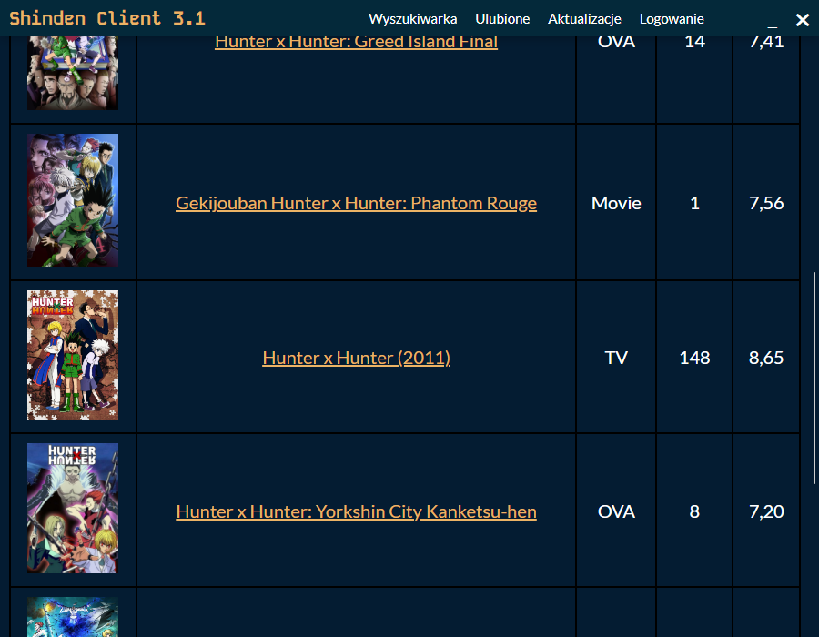
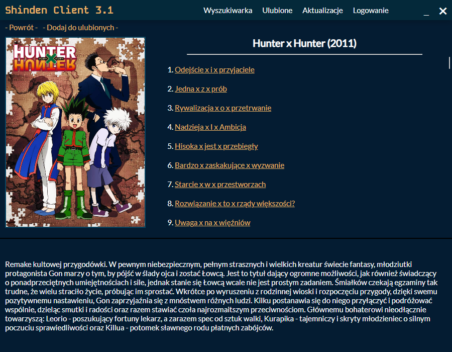
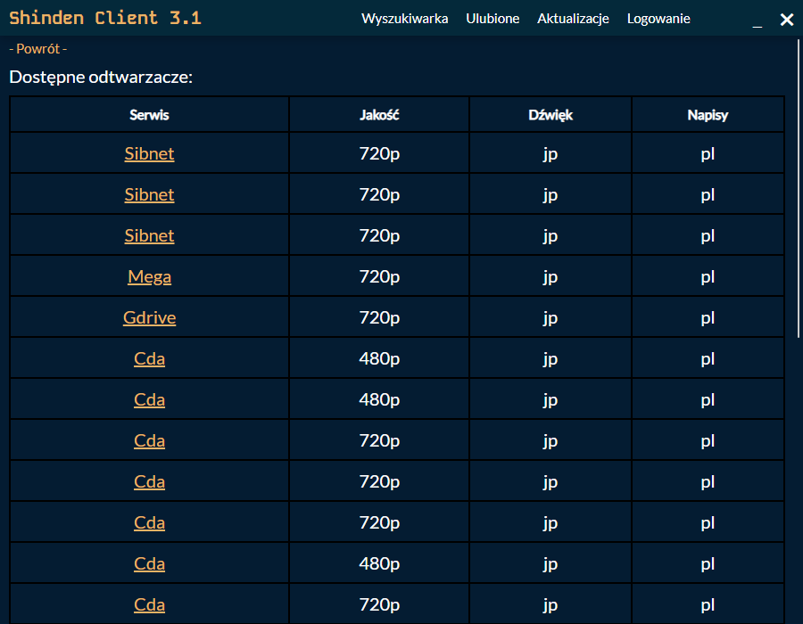
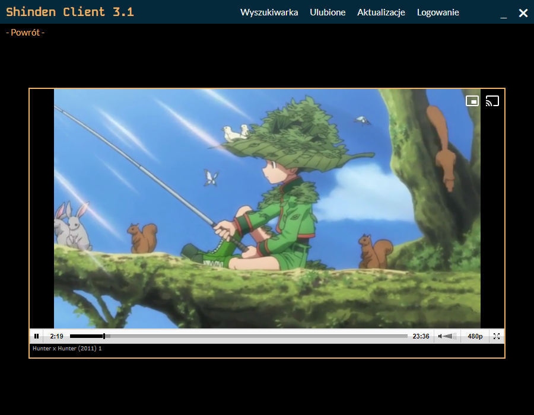
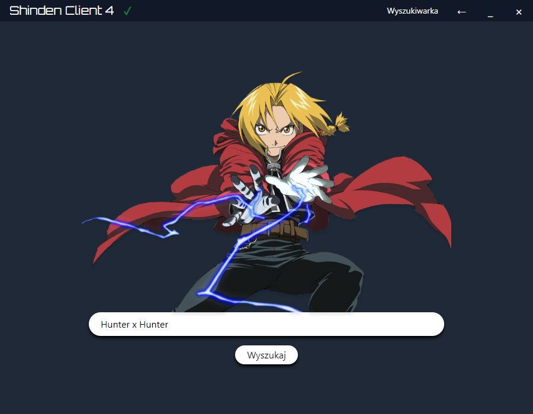
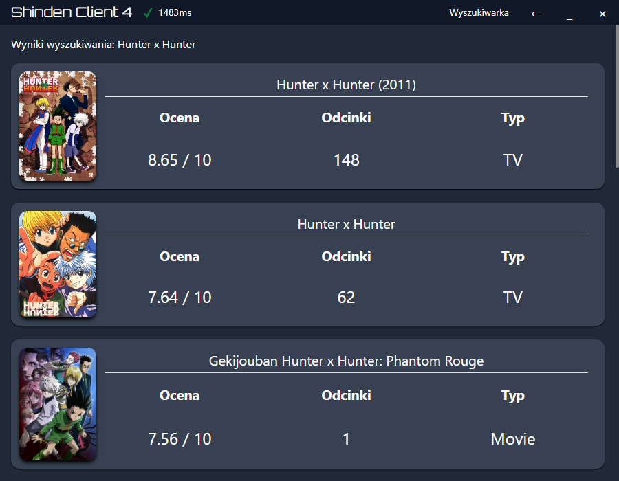

# Shinden Client

**Welcome to the repository of the shinden-client project, an application that allows you to watch anime without unwanted ads and pop-ups.**

***Currently, only the Polish language and the shinden.pl website are supported!***

## What is currently working? Shinden Client 3.1 - Electron
You can:
- search for anime from the shinden.pl website
- watch most of the searched series
- log in to your user account on shinden.pl to watch anime blocked for non-logged-in users
- add anime to your favorites list

Additionally, all ads and pop-ups are blocked!

# Project goals

Currently, the app is not yet what it was intended to be. Here's a brief description of what direction the whole project is developing into.

## Universal way to watch anime from all known sites
Shinden Client is intended to be a local search engine and parser for known anime sites. Watching anime is supposed to be as easy as possible:
1. Type in the name
2. Search
3. Choose the appropriate series
4. Choose the episode
5. Choose the platform on which you want to watch
6. Enjoy!

## Easy to expand
The backend of the new version of the application (Shinden Client 4) is written in Rust language, thanks to the versatility of this solution, it will be easy to develop and add support for new sites.

## Support for more languages
Although the application was created with mainly Polish users in mind, we want it to be as accessible as possible to everyone around the world.

# Screenshots of the current version 3.1 (Electron)

# About Shinden Client 4

- The project is currently being rewritten in Tauri (Rust + SvelteKit) under the name Shinden Client 4.
- Shinden Client 3.1 created in Electron will lose support as of the release of version 4. However, it is possible that it will receive some updates.
- We are writing the new version in a way that allows the project to be easily extended with new anime sites. Replacing Electron with Tauri brings many benefits including a faster backend.

Progress can be tracked in the [rust-rewrite branch](https://github.com/KlapChat-Entertainment/shinden-client/tree/rust-rewrite).

## Preview screenshots of the new version

# Contributing

Pull requests are welcome. For major changes, please open an issue first to discuss what you would like to change.
